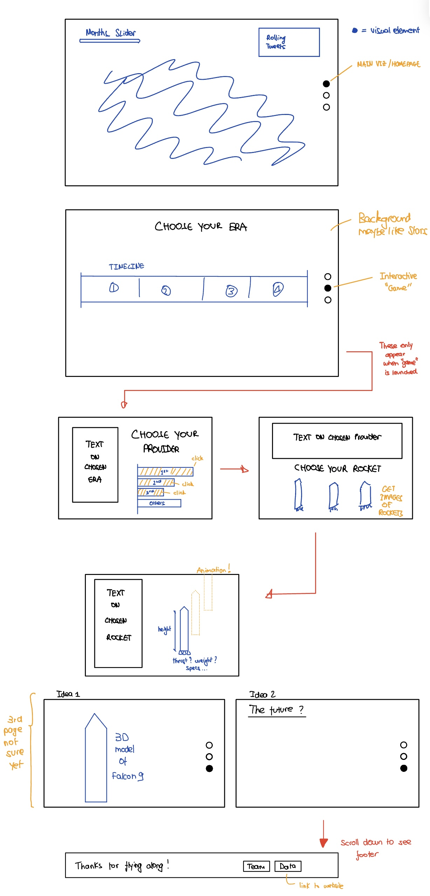

# Milestone 2

The goal of this project is to create an interactive website that guides users through the history of rocket launches and the broader space race industry. By combining data-driven storytelling with visual exploration, the project aims to educate users on how space exploration evolved over time—from its early Cold War beginnings to the modern era of commercial space travel. Through a clear and engaging interface, users are invited to travel through time, explore major players and technological advances, and gain a deeper understanding of the global effort behind reaching space.

**Website prototype :  [\[view\]](https://data-viz-4ed.pages.dev)**

### Website Structure

To provide a coherent and layered experience, the website is divided into three main sections. Each section is designed to serve a specific purpose and progressively deepen the user's understanding of the space industry. You can find the sketch of the website layout below.

**Sketch of our ideas :**

  

#### 1st Section

> The first section consists of an interactive world map that visualizes global rocket launches across time. Users can navigate through different time periods using a slider or autoplay function, witnessing how launch activity changes from year to year. Each launch site is represented by a colored marker that scale with the number fo launches made from it. The color also deponf on whether the majority of launches was successful, failed, or planned. When hovering over these markers, users receive detailed information about the site, including the number of launches and the outcomes associated with them. Additionally, key historical events are highlighted on the side to provide context and guide the narrative. 

> The goal of this section is to offer an intuitive, high-level overview of space activity worldwide and introduce users to the historical rhythm of space launches.

#### 2nd Section

> The second section offers a more detailed and guided exploration in the form of an interactive "game". Here, users begin by selecting a specific time period, which filters the dataset to highlight the manufacturers that were most active during that era. Once a manufacturer is chosen, the interface reveals the most commonly used rockets they produced in that time span with additional information on the manufacturer. Selecting a rocket unlocks a dedicated view displaying its specifications, technical details, launch statistics, and notable missions.

> This section allows users to dive into the engineering and industrial side of the space race. Its purpose is to let users trace the evolution of space technology through the lens of its creators and their most iconic machines.

#### 3rd section

> The final section is still in development but is intended to provide a culminating visualization that connects and reflects upon the broader themes uncovered in the first two parts. Whether it’s a futuristic look at where space travel is heading or an interactive 3D model of the Falcon 9 rocket this last part will aim to synthesize the data into a meaningful and thought-provoking conclusion.

Altogether, the website is designed as a journey—moving from global patterns to individual contributors and their innovations, and finally, to a holistic understanding of how humanity has pursued its ambition to explore beyond Earth.

### List of tools
 
- React To build the structure of the website

- D3.js For creating dynamic and interactive data visualizations, such as charts and visual storytelling elements

- GSAP To add smooth animations and transitions that enhance user experience and bring the interface to life

### Extra ideas

> One enhancement we considered is adding smooth, animated transitions in the second section. As users select a period, manufacturer, or rocket, elements could fade or slide into view to create a more fluid and engaging experience. These transitions would improve both navigation and visual appeal.

> We also explored including a fully interactive 3D model of the Falcon 9 rocket in the final section. Users could rotate and explore its components for a deeper understanding of its structure.